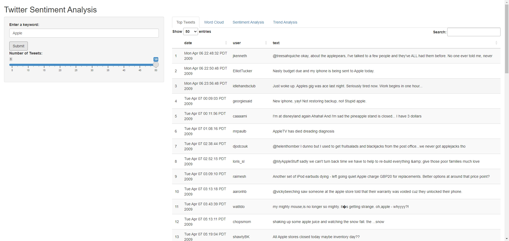
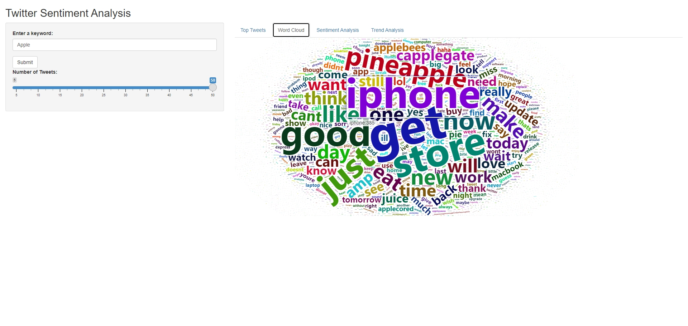
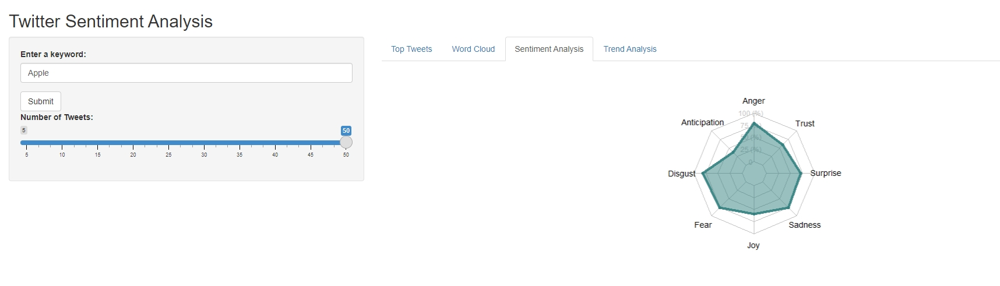

## Project Intro

This project focuses on analyzing the sentiments of Twitter data related to specific keywords. Utilizing the `syuzhet` package, it conducts sentiment scoring based on the comprehensive NRC Word-Emotion Association Lexicon. The analysis encompasses eight distinct emotional dimensions: anger, anticipation, disgust, fear, joy, sadness, surprise, and trust. 

Additionally, the project features a visualization component that tracks the evolution of the overall sentiment score over time, offering a dynamic view of public sentiment trends in relation to the chosen keywords. 

## Load helper library

```{r message=FALSE, warning=FALSE}
library(data.table);library(textstem);library(lubridate)
library(tm);library(syuzhet);library(ggplot2);library(hrbrthemes);library(wordcloud);library(wordcloud2)
```


## [Sentimental data](https://www.kaggle.com/datasets/kazanova/sentiment140) Preprocessing

* **target**: the polarity of the tweet (0 = negative, 2 = neutral, 4 = positive)
* **ids**: The id of the tweet (2087)
* **date**: the date of the tweet (Sat May 16 23:58:44 UTC 2009)
* **flag**: The query (`lyx`). If there is no query, then this value is `NO_QUERY`.
* **user**: the user that tweeted (`robotickilldozr`)
* **text**: the text of the tweet (`Lyx` is cool)

```{r}
data <- read.csv("./inputs.csv", header = FALSE, col.names = c("target", "ids", "date", "flag", "user", "text"), encoding = "UTF-8")
summary(data)
```

### Search tweets contains certain keywords

```{r}
search_tweets <- function(tweets_df, keyword, ignore.case = TRUE) {
  tryCatch({
    # Ensure tweets_df is a data.table
    setDT(tweets_df)
    # Vectorized search for keyword
    suppressWarnings(keyword_filtered <- tweets_df[grepl(keyword, text, ignore.case = ignore.case)])
    return(keyword_filtered)
  }, error = function(e) {
    stop("An error occurred: ", conditionMessage(e))
  })
}
```

```{r message=FALSE, warning=FALSE}
test_result <- search_tweets(data,"apple")
summary(test_result)
```

### Sentiment Analysis

#### Data Preprocessing

* Lemmatization
  * `Lemmatization` is a linguistic process that reduces a word to its base or dictionary form, known as a `lemma`.
  * `lemmatization` considers the context and transforms words to their meaningful base forms. For example, "running," "ran," and "runs" would all be lemmatized to "run."
  * `Lemmatization` is important in NLP because it groups together different inflected forms of a word, allowing them to be analyzed as a single item.

```{r}
preprocess_text <- function(text_column) {
  text_column <- tolower(text_column)                   # Convert text to lowercase
  text_column <- removePunctuation(text_column)         # Remove punctuation
  text_column <- removeNumbers(text_column)             # Remove numbers
  text_column <- removeWords(text_column, stopwords("en")) # Remove stopwords
  text_column <- stripWhitespace(text_column)           # Strip extra whitespace
  text_column <- lemmatize_strings(text_column)         # Apply lemmatization
  return(text_column)
}
```

#### Calculating Sentiment Scores

* The sentiment score is a measure of the emotional tone behind a series of words. It is determined by analyzing the presence of words and phrases that are `positively` or `negatively` expressed.
* In our case, we'll use the `syuzhet` package, which relies on the NRC Word-Emotion Association Lexicon. This lexicon associates words with `emotions` (**like joy, sadness, anger, etc.**) and `sentiment` valence (**positive or negative**).

```{r}
analyze_sentiment <- function(preprocessed_text) {
  sentiment_scores <- get_nrc_sentiment(preprocessed_text)
  sentiment_scores$overall_sentiment <- sentiment_scores$positive - sentiment_scores$negative
  return(sentiment_scores)
}
```

#### Working with the data

```{r}
# Preprocess the text
test_result[, text_clean := preprocess_text(text)]

# Calculate sentiment scores
sentiment_results <- analyze_sentiment(test_result$text_clean)
```

#### Visualize the results

```{r}
## Word Cloud

# Create a corpus  
docs <- Corpus(VectorSource(test_result$text_clean))
dtm <- TermDocumentMatrix(docs) 
matrix <- as.matrix(dtm) 
words <- sort(rowSums(matrix),decreasing=TRUE) 
df_words <- data.frame(word = names(words),freq=words)
```

```{r fig.height=5, fig.width=5}

set.seed(1234) # for reproducibility 

# wordcloud(words = df_words$word, freq = df_words$freq, min.freq = 1,
#           max.words=200, random.order=FALSE, rot.per=0.15,
#           colors=brewer.pal(8, "Set2"))
wordcloud2(data=df_words, size=4, color='random-dark')
```


```{r}
colnames(sentiment_results)
```


```{r fig.height=5, fig.width=5}
# Create a data frame with average scores for each emotion
emotion_averages <- data.frame(
  Anger = mean(sentiment_results$anger),
  Anticipation = mean(sentiment_results$anticipation),
  Disgust = mean(sentiment_results$disgust),
  Fear = mean(sentiment_results$fear),
  Joy = mean(sentiment_results$joy),
  Sadness = mean(sentiment_results$sadness),
  Surprise = mean(sentiment_results$surprise),
  Trust = mean(sentiment_results$trust)
)

# Add a row for the minimum value for each category for plotting
emotion_df <- rbind(rep(0, ncol(emotion_averages)),rep(1, ncol(emotion_averages)), emotion_averages)


# Create the radar chart
fmsb::radarchart(emotion_df, axistype = 1,
        #custom polygon
        pcol=rgb(0.2,0.5,0.5,0.9) , pfcol=rgb(0.2,0.5,0.5,0.5) , plwd=4,
        #custom the grid
        cglcol="grey", cglty=1, axislabcol="grey", caxislabels=seq(0,1,5), cglwd=0.8,
        #custom labels
        vlcex=1.2)


```

```{r message=FALSE, warning=FALSE}
# Chart
p <- ggplot(sentiment_results, aes(x=x) ) +
  # Top
  geom_density( aes(x = positive, y = ..density..), fill="#69b3a2" ) +
  geom_label( aes(x=4.5, y=0.25, label="Positive"), color="#69b3a2") +
  # Bottom
  geom_density( aes(x = negative, y = -..density..), fill= "#404080") +
  geom_label( aes(x=4.5, y=-0.25, label="Negative"), color="#404080") +
  theme_ipsum() +
  xlab("Tweets Sentimental Score")
p
```

```{r message=FALSE, warning=FALSE}
# basic histogram
p <- ggplot(sentiment_results, aes(x=overall_sentiment)) + 
  geom_histogram(binwidth = 1, fill="#69b3a2", color="#e9ecef", alpha=0.9) +
  theme_ipsum() + 
  xlab("Overall Sentimental Score")
p
```
### Check the trend

#### Step 1: Parse the Dates
```{r}
test_result$date_parsed <- as.Date(strptime(test_result$date, format = "%a %b %d %H:%M:%S PDT %Y"))
summary(test_result$date_parsed)
```
#### Step 2: Aggregate Daily Averages

```{r}
test_result$overall_sentiment <- sentiment_results$overall_sentiment
daily_avg_sentiment <- aggregate(overall_sentiment ~ date_parsed, data = test_result, mean)
summary(daily_avg_sentiment)
```
#### Step 3: Plot the Data

```{r message=FALSE, warning=FALSE}
# Fit a linear model
model <- lm(overall_sentiment ~ date_parsed, data = daily_avg_sentiment)

# Extract slope and R^2 value
slope <- coef(model)[2]
r_squared <- summary(model)$r.squared

# Your original ggplot code
p <- ggplot(daily_avg_sentiment, aes(x = date_parsed, y = overall_sentiment)) +
  geom_point() +
  geom_smooth(method = "lm", se = FALSE) +
  labs(title = "Daily Average Overall Sentiment Score",
       x = "Date",
       y = "Average Sentiment Score") +
  theme_minimal()

# Add annotations for slope and R^2
p + annotate("text", x = as.Date(quantile(as.numeric(daily_avg_sentiment$date_parsed),0.75)), y = 1.2, 
             label = paste("Slope:", round(slope, 4), "\nR^2:", round(r_squared, 4)),
             hjust = 0, vjust = 0)


```

## Shiny APP

### Query Tweets by keywords



### Generate Word cloud and explore the word counts



### Sentimental Analysis from 8 aspects



### Temporal Anlaysis with tweets


